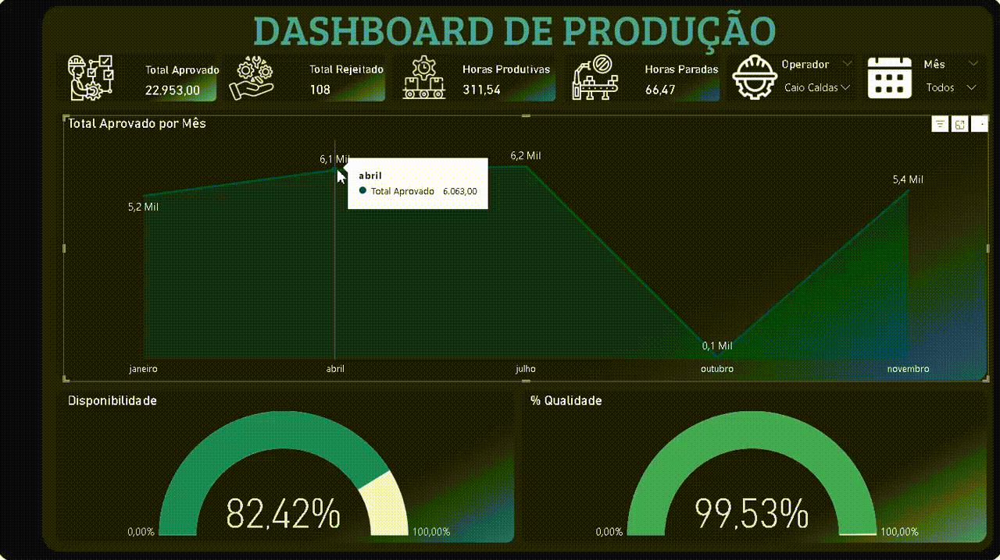

# 🏭 Dashboard de Controle de Produção e Eficiência Industrial

## 📋 Contexto do Projeto
Este dashboard foi desenvolvido para o monitoramento em tempo real de uma linha de produção. O foco principal é a visibilidade sobre a **eficiência operacional (OEE)**, o controle de desperdício e a produtividade por equipe/operador.

A base de dados contém registros detalhados de ordens de produção, incluindo horários de início/fim, tempos de preparação de máquina (set-up), controle de qualidade e volumes de peças aprovadas ou rejeitadas.

---

## 📸 Demonstração

*Legenda: Análise de produtividade e taxa de rejeição por turno e produto.*

---

## 🛠️ Funcionalidades e KPIs
O dashboard oferece as seguintes análises:

1.  **Indicadores de Qualidade:** Monitoramento da taxa de rejeição (`Qtd Aprovada` vs `Qtd Rejeitada`) para identificar falhas no processo.
2.  **Eficiência de Tempo:** Cálculo do `Total Horas` gastas por ordem, diferenciando tempo produtivo de tempos de "Preparação de Máquina" e "Controle de Qualidade".
3.  **Performance por Operador:** Ranking de produtividade dos operadores, permitindo identificar necessidades de treinamento ou gargalos manuais.
4.  **Análise de Produto:** Visão detalhada de quais produtos demandam mais tempo de máquina e quais possuem maior índice de perdas.
5.  **Linha do Tempo:** Acompanhamento da produção diária para identificação de variações de capacidade.

---

## 🧮 Tecnologias e Conceitos Aplicados
* **Power BI:** Visualização e dashboard interativo.
* **Cálculos de Tempo (DAX):** Transformação de durações de horas/minutos para métricas decimais e formatos de tempo amigáveis.
* **Tratamento de Dados (Power Query):** Limpeza e padronização das "Ocorrências" e junção dos horários de início e fim.
* **Gestão Lean:** Foco na redução de desperdícios (rejeitos) e otimização de tempo.

---

## 📂 Estrutura do Repositório
* `dash_produção.pbix`: Arquivo original do Power BI.
* `Produção.xlsx - BaseProdução.csv`: Dados brutos da produção (limpos e prontos para uso).
* `/assets`: Pasta com os recursos visuais do projeto.

---

## 🚀 Como Executar
1. Faça o download do repositório.
2. Abra o arquivo `dash_produção.pbix`.
3. Caso os dados não carreguem, vá em "Transformar Dados" e ajuste o caminho da fonte para o arquivo `.csv` local no seu computador.

---

## ✍️ Autor
**Fernano Tinno Venceslau**
* [LinkedIn](https://www.linkedin.com/in/fernando-tinno/)

---